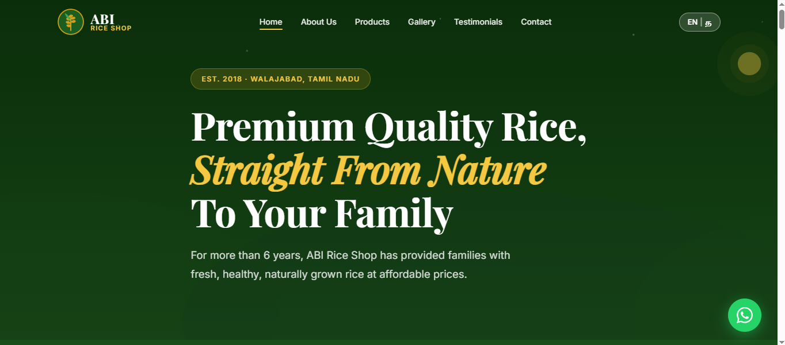
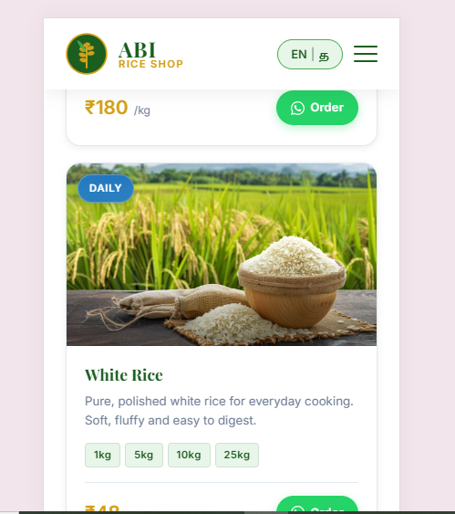
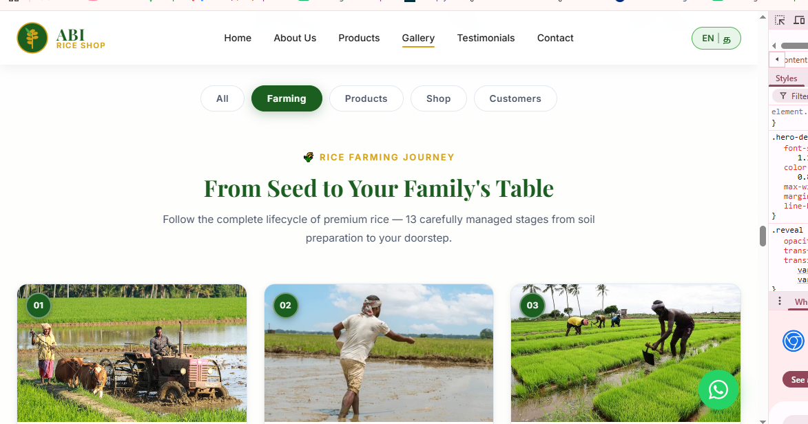

# 🌾 ABI Rice Shop Website

A modern, responsive business website developed for **ABI Rice Shop**, a premium rice store located in Walajabad, Tamil Nadu.

This project was built as a real-world frontend practice project to simulate working with a client. The website focuses on creating a professional online presence for a local business with a clean design, responsive layout, and bilingual support.

---

## 📌 Project Overview

The ABI Rice Shop website helps customers:

- Learn about the business
- Explore different rice varieties
- View the rice farming journey
- Browse the product gallery
- Contact the shop easily through WhatsApp or the contact form
- Switch between English and Tamil

---

## ✨ Features

- ✅ Responsive design (Desktop, Tablet & Mobile)
- ✅ Modern UI with nature-inspired theme
- ✅ English / Tamil language switch
- ✅ Dynamic product section using JavaScript
- ✅ Rice farming journey gallery
- ✅ Product gallery with category filtering
- ✅ WhatsApp floating button
- ✅ Contact form
- ✅ Testimonials section
- ✅ Custom SVG favicon
- ✅ Smooth scrolling navigation

---

## 🛠️ Technologies Used

- HTML5
- CSS3
- JavaScript (ES6)
- GitHub Pages

---

## 📸 Screenshots

### Desktop View

### Mobile View

### Tab View

---

## 🎯 Purpose of this Project

This project was created to improve my frontend development skills by building a real business website from client requirements.

During this project, I learned:

- Responsive web design
- JavaScript DOM manipulation
- Dynamic content rendering
- Bilingual website implementation
- Website structure and UI design
- GitHub deployment

---

## 🚀 Live Demo

(Add your GitHub Pages link here after deployment)

Example:

https://prema97cs-glitch.github.io/abi-rice-shop/

---

## 💻 GitHub Repository

(Add your GitHub repository link)

Example:

https://github.com/prema97cs-glitch/abi-rice-shop

---

## 👩‍💻 Developed By

**Premakumari P**

Frontend Developer

LinkedIn:
(Add your LinkedIn profile link)

Portfolio:
(https://www.linkedin.com/in/premakumari07091997/)

---

⭐ Thank you for visiting this project!
